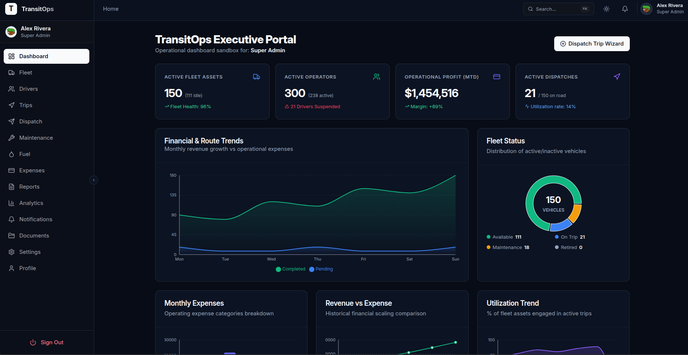
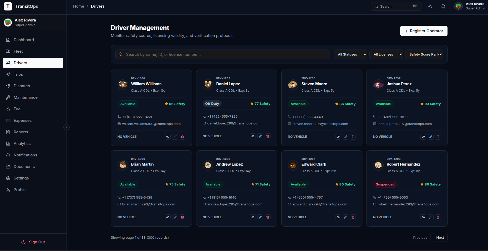
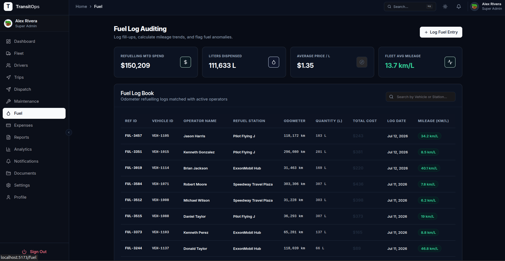
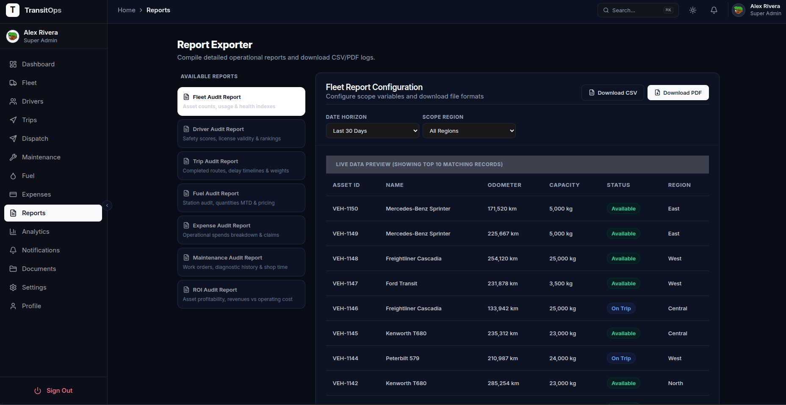
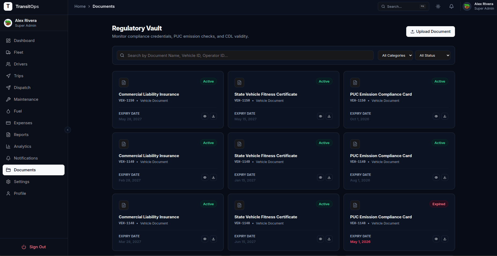

# 🚚 TransitOps — Our 8-Hour Hackathon Journey

> **Building an Enterprise Transport Management System in just 8 Hours**


---

# 🏆 The Challenge

During our college's **8-hour hackathon**, we wanted to solve a problem that exists across logistics companies, manufacturing firms, universities, and transport operators.

Instead of building another AI chatbot, we challenged ourselves to build an **enterprise-grade Transport Management System (TMS)** capable of managing an organization's complete transportation workflow.

Our goal wasn't just to build a beautiful dashboard.

We wanted to simulate how a real transport department operates—from vehicle registration to trip completion, maintenance scheduling, fuel tracking, expense management, and analytics.

---

# 💭 The Problem We Chose

Many organizations still rely on spreadsheets, WhatsApp groups, and paperwork to manage their transport operations.

This often leads to:

- Vehicle scheduling conflicts
- Driver assignment issues
- Missed maintenance
- Expired licenses
- Poor expense tracking
- No centralized visibility
- High operational costs

We wanted to digitize this entire workflow.

---

# 💡 Our Idea

We built **TransitOps**, a centralized Transport Management Platform where every stakeholder—from administrators to drivers—works on the same system.

Instead of managing operations manually, users can:

- Register vehicles
- Manage drivers
- Plan trips
- Dispatch vehicles
- Track maintenance
- Record fuel usage
- Monitor expenses
- View analytics
- Generate reports

All through one unified dashboard.

---

# ⏱️ Our 8-Hour Journey

## Hour 1 — Understanding the Problem

Instead of writing code immediately, we mapped the complete transport workflow.

```text
Vehicle
    ↓
Driver
    ↓
Trip
    ↓
Dispatch
    ↓
Maintenance
    ↓
Fuel
    ↓
Expenses
    ↓
Analytics
```

This workflow became the foundation of our application architecture.

---

## Hour 2 — UI Planning

Before implementation, we designed the application's navigation and modules.

We identified the major sections:

- Dashboard
- Fleet
- Drivers
- Trips
- Maintenance
- Fuel
- Expenses
- Reports
- Analytics

---

## Hour 3–5 — Development Sprint

We divided the work and developed multiple modules simultaneously.

Implemented:

- Authentication
- Dashboard
- Vehicle Management
- Driver Management
- Trip Management
- Dispatch Engine

Our philosophy was simple:

> **Functionality first, polish later.**

---

## Hour 6 — Business Logic

We implemented business validations that make the platform realistic.

Examples:

- One driver cannot drive two vehicles.
- One vehicle cannot be assigned twice.
- Vehicles under maintenance cannot be dispatched.
- Drivers with expired licenses cannot be assigned.
- Vehicle availability updates automatically.

---

## Hour 7 — Analytics Dashboard

We built dashboards displaying:

- Fleet utilization
- Vehicle status
- Driver availability
- Active trips
- Fuel expenses
- Maintenance overview

---

## Hour 8 — Final Polish

The remaining time focused on:

- UI improvements
- Bug fixing
- Responsive design
- Demo preparation
- Final presentation

---

# 🚀 What We Built

Although this was a hackathon project, we successfully implemented the core workflow of an enterprise Transport Management System.

## Authentication

- Secure Login
- JWT Authentication
- Role-Based Access Control

## Fleet Management

- Vehicle Registration
- Vehicle Profiles
- Vehicle Status
- Search & Filters

## Driver Management

- Driver Records
- License Details
- Driver Status
- Trip History

## Trip Management

```text
Draft
   ↓
Assign Driver
   ↓
Assign Vehicle
   ↓
Validation
   ↓
Dispatch
   ↓
On Trip
   ↓
Completed
```

## Dispatch Validation

The system automatically checks:

- Duplicate assignments
- Invalid licenses
- Maintenance conflicts
- Capacity violations

## Maintenance

- Schedule servicing
- Track maintenance history
- Automatic vehicle blocking

## Fuel & Expense Management

- Fuel logging
- Cost tracking
- Mileage calculation
- Operational expenses

## Analytics Dashboard

Visual insights into:

- Fleet utilization
- Revenue
- Operational costs
- Fuel trends
- Driver availability

---

# 🧠 Business Rules

To simulate a real enterprise system, we implemented operational rules such as:

- Vehicle registration numbers must be unique.
- Vehicles under maintenance cannot be dispatched.
- Drivers with expired licenses cannot be assigned.
- A vehicle can only participate in one active trip.
- Completing a trip automatically restores vehicle availability.

---

# 👥 User Roles

TransitOps supports multiple organizational roles:

- Super Admin
- Fleet Manager
- Dispatcher
- Driver
- Safety Officer
- Financial Analyst

Each role has dedicated permissions and responsibilities.

---

# 🛠️ Tech Stack

## Frontend

- React
- TypeScript
- Vite
- Tailwind CSS
- shadcn/ui

## Backend

- Node.js
- Express.js

## Database

- MongoDB

## Authentication

- JWT
- BCrypt

## File Storage

- Cloudinary

---

# 📂 Project Structure

```text
client/
├── components/
├── pages/
├── layouts/
├── hooks/
├── services/
└── ...

backend/
├── controllers/
├── models/
├── routes/
├── middlewares/
├── services/
└── ...
```

---

# 📸 Screenshots











---

# 🎯 What We Learned

This hackathon pushed us beyond building CRUD applications.

It taught us how to:

- Design enterprise workflows before coding.
- Translate real-world operations into software.
- Implement meaningful business rules.
- Collaborate effectively under strict time constraints.
- Prioritize features that deliver the most value.

More importantly, we learned that successful software starts with understanding the business process—not just writing APIs.

---

# 🚀 What's Next?

If we continue developing TransitOps, we plan to add:

- Live GPS Tracking
- AI-powered Route Optimization
- Predictive Maintenance
- Driver Mobile Application
- IoT Vehicle Monitoring
- Multi-Tenant SaaS Support
- Geofencing
- AI Dispatch Assistant
- Fuel Fraud Detection

---

# ❤️ Team Introduction

> **"From idea to enterprise prototype in just 8 hours."**

Built by ,

<table>
  <tr>
    <td align="center">
      <a href="https://github.com/vanshMittal37">
        <br />
        <sub><b>Vansh Mittal</b></sub>
      </a>
    </td>
    <td align="center">
      <a href="https://github.com/Yashgupta174">
        <br />
        <sub><b>Yash Gupta</b></sub>
      </a>
    </td>
    <td align="center">
      <a href="https://github.com/adi2025a">
        <br />
        <sub><b>Aditya Singh</b></sub>
      </a>
    </td>
  </tr>
  
</table>

---
# Project-Setup 

## 👥 Role-Based Test Accounts

Below are the pre-configured user credentials for testing role-based access control (RBAC):

| Role | Email | Password | Details |
| :--- | :--- | :--- | :--- |
| **Super Admin** | `admin@transitops.com` | `Admin@1234` | Full access to all modules, settings, and user provisioning. |
| **Fleet Manager** | `fleetmanager@transitops.com` | `Test@1234` | Complete access to Vehicles, Drivers, Maintenance, and Analytics. |
| **Dispatcher** | `dispatcher@transitops.com` | `Test@1234` | Can schedule, dispatch, and track Trips, and assign drivers. |
| **Driver** | `driver@transitops.com` | `Test@1234` | Assigned driver dashboard (matches driver ID `DRV-1001`). Can view logs & trips. |
| **Safety Officer** | `safetyofficer@transitops.com` | `Test@1234` | Access to safety scores, police verifications, and compliance monitoring. |
| **Financial Analyst** | `analyst@transitops.com` | `Test@1234` | Access to Expense logs, fuel efficiency analytics, and financial reporting. |

---

## 🚀 Setup & Launch Instructions

### Prerequisites
- Node.js (v18+)
- MongoDB Atlas (provided in the backend configuration)

### Running the Backend
1. Navigate to the `backend/` directory:
   ```bash
   cd backend
   ```
2. Install dependencies:
   ```bash
   npm install
   ```
3. Run compilation and start server:
   ```bash
   npx tsc
   node dist/index.js
   ```
   *The backend will boot on `http://localhost:5000`.*

### Running the Frontend
1. Navigate to the `frontend/` directory:
   ```bash
   cd frontend
   ```
2. Install dependencies:
   ```bash
   npm install
   ```
3. Run the Vite development server:
   ```bash
   npm run dev
   ```
   *The frontend will boot on `http://localhost:5173` (or the next available port).*